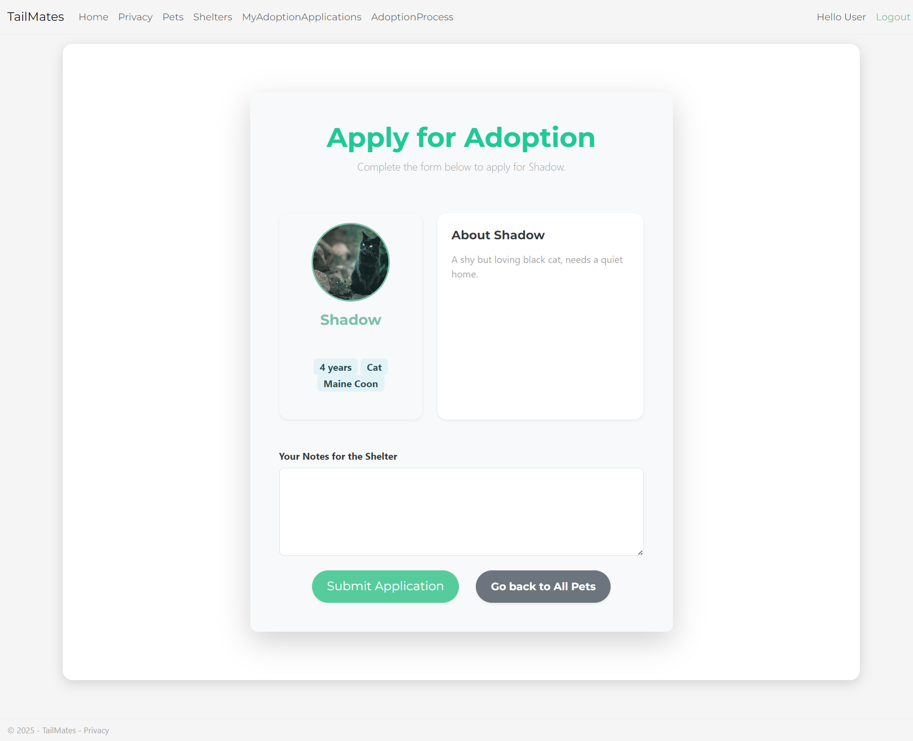
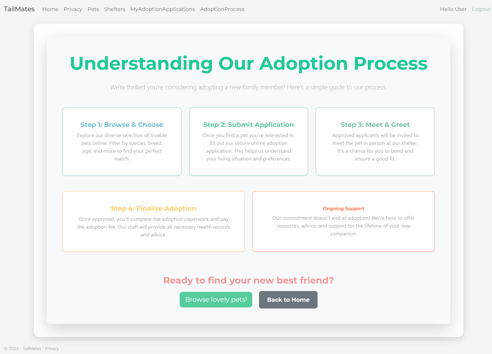
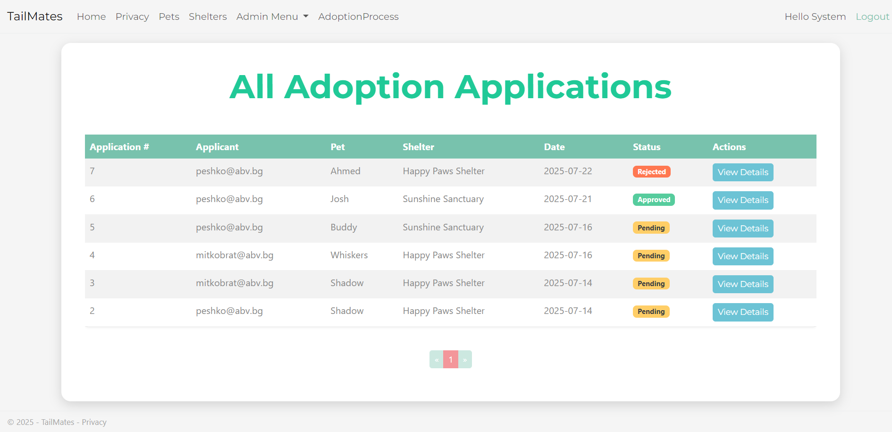
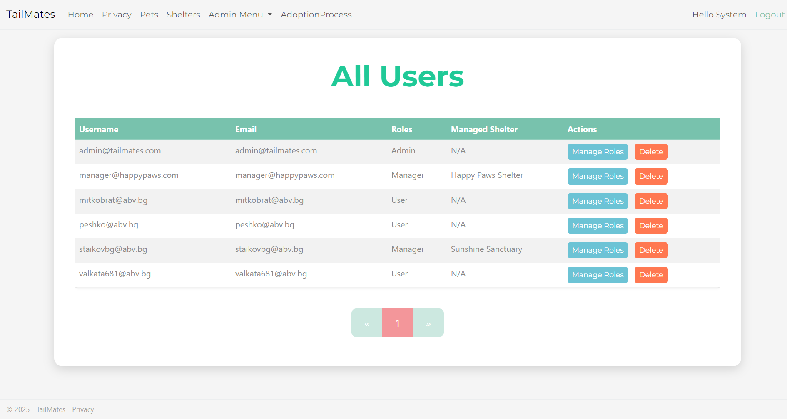

# 🐾 TailMates - ASP.NET Core Pet Adoption Platform

TailMates is a comprehensive web application built with **ASP.NET Core** designed to streamline the pet adoption process. It connects shelters with potential adopters, allowing users to browse available pets, submit adoption applications, and track their status. The platform features a robust administrative interface for managing users, pets, and applications.

---

### ✨ Features

* 🔐 **User Authentication & Authorization:** Secure user registration, login, and role-based access control (Admin, Manager, User).

* 🏡 **Pet Catalog & Shelter Listings:** Browse a detailed catalog of adoptable pets with filtering options, and view information about various shelters.

* 📝 **Adoption Applications & Status Tracking:** Users can submit applications for pets and track the real-time status of their submissions.

* 📤 **Image Management:** Pets can have associated images for better presentation.

* 📃 **Clean Architecture:** Implemented with a clean MVC and Service Layer architecture for maintainability and scalability.

* 🔔 **Notification System:** Utilizes TempData for user feedback messages (success/error).

* 🗂️ **Admin / Manager / User Areas:** Dedicated sections for different user roles, including user and role management for administrators.

---

### 🖼️ Screenshots

Here are some screenshots showcasing key features of the TailMates application:

### 🔹 Home Page


### 🔹 Pet Listings Page


### 🔹 Pet Details Page


### 🔹 Apply for Adoption Page


### 🔹 Understanding Our Adoption Process


### 🔹 User Adoption Applications (My Applications)


### 🔹 Admin Panel – All Adoption Applications


### 🔹 Admin Panel – All Users (User Management)


---

### 🧪 Test Credentials

You can use the following credentials to explore different roles within the application:

* **Admin:** `admin@tailmates.com` / `AdminPassword123!`

* **Manager:** `manager@happypaws.com` / `ManagerPassword123!`

* **User:** Newly registered users will automatically have the "User" Role.

---

### 🛠️ Technologies Used

* **ASP.NET Core 8:** The core framework for building the web application (MVC & Razor Pages).

* **Entity Framework Core:** ORM for database interaction.

* **SQL Server:** Relational database management system.

* **Bootstrap 5:** Frontend framework for responsive and modern UI.

* **FontAwesome:** For scalable vector icons.

* **Repository Pattern & Service Layer:** For separation of concerns and business logic encapsulation.

* **TempData / Toast Messaging:** For displaying transient success/error messages to the user.

* **Area-based Role Management:** Organized structure for handling different user roles and their functionalities.

---

### 📂 Project Structure

* `TailMates.Data` – Contains the `DbContext`, repositories, migrations, and seed data.

* `TailMates.Data.Models` – Entity models representing database tables.

* `TailMates.Data.Common` – Common validation constants for entities.

* `TailMates.Services.Core` – Core business logic and service interfaces/implementations.

* `TailMates.Services.Common` – Shared constants used across services (if applicable).

* `TailMates.Services.Core.Tests` – Unit tests for the business logic (if applicable).

* `TailMates.Web` – Presentation layer (MVC controllers, Razor views, and startup configuration).

* `TailMates.Web.Infrastructure` – Common utilities for the Web project (extensions, custom middlewares) (if applicable).

* `TailMates.Web.ViewModels` – ViewModels used for data transfer between views and controllers.

* `TailMates.GCommon` – Global constants, enums, and shared validation logic (if applicable).

* `screenshots` - 📸 Screenshots used in README

* `README.md` – Project documentation.

---

### 🚀 How to Run the Project

1.  **Clone the repository:**

    ```bash
    git clone https://github.com/Adkosu123/TailMates.git
    ```

2.  **Navigate to the project directory:**

    ```bash
    cd TailMates
    ```

3.  **Restore dependencies:**

    ```bash
    dotnet restore
    ```

4.  **Database Setup:**
    Ensure your database connection string in `appsettings.json` is correct. Then, apply migrations to create or update your database schema:

    ```bash
    dotnet ef migrations add InitialCreate # Or the name of your latest migration
    dotnet ef database update
    ```

    *(If you encounter issues with `dotnet ef`, ensure you have the `dotnet-ef` tool installed: `dotnet tool install --global dotnet-ef`)*

5.  **Run the application:**

    ```bash
    dotnet run
    ```

6.  **Open your browser** and navigate to:

    ```
    http://localhost:{localPort}
    ```

    (The local port will be displayed in your console after running `dotnet run`).

---

### 📜 License

This project is licensed under the MIT License. See the `LICENSE` file for details.

Enjoy exploring the **TailMates** project! 🐾
